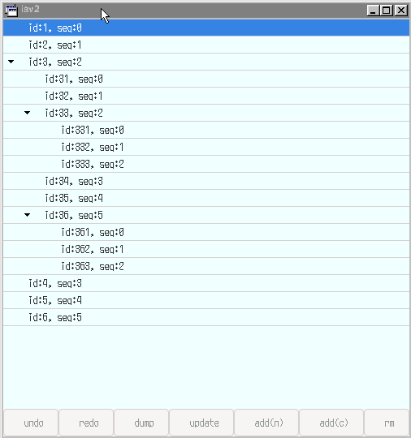

# Summary

This is an practice of tree list with Gtk4 and Rust which can be reorderable by drag and drop.

# Drag and drop

## Drag from a node to an expander

When the node is dropped on the top half of the expander, the node becomes a parent with that expander's node as a neighbor.
On the other hand, on the lower half, the node becomes a neighbor of the expander's node.

## Drag from a node to a label

When the node is dropped on the top half of the label, the node becomes a parent with that label's node as a neighbor.
On the other hand, on the lower half, the node becomes a child of the label's node.

# Buttons

- dump: prints the tree data structure to standard output

- update: redraw tree

- add(n): add a neighbor to the selected node

- add(c): add a child to the selected node

# Demo

